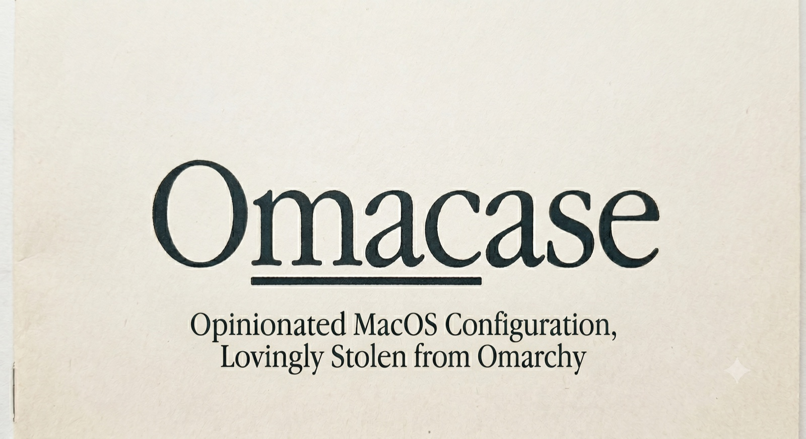

# Omacase

**Yes, this is what you think it is. Omarchy for MacOS, lol.**

An opinionated, tiling macOS — installed, configured, themed, and managed from a
single command. Omarchy's ethos (keyboard-first, one consistent theme everywhere,
one-command reproducible) translated to where macOS actually wants to go.

**Supported platform:** Apple Silicon Macs with Homebrew installed at
`/opt/homebrew`. Intel Macs and custom Homebrew prefixes are intentionally out
of scope.

**The Rules**
 - The first rule of Omacase is that we don't fight with MacOS. We compromise 
polish for ease of maintenance.
- The second rule of Omacase is that it uninstalls just as easily as it installs.

```bash
/bin/bash -c "$(curl -fsSL https://omacase.org/install)"
```

This installs Xcode CLT + Homebrew, clones to `~/.local/share/omacase`, and runs
`omacase install`. Then:

```bash
omacase doctor      # grant Accessibility to AeroSpace, SketchyBar, Karabiner
```

## The stack
| Layer | Pick |
|---|---|
| Window manager | **AeroSpace** (no SIP disable) — i3-style tiling |
| Status bar | **SketchyBar** |
| Borders | **JankyBorders** ([splaice fork](https://github.com/splaice/JankyBorders): `square_apps=` matches square-cornered windows like undecorated Ghostty) |
| Launcher | **Spotlight** (built in — Tahoe actions, clipboard, Quick Keys) |
| Keyboard | **Karabiner-Elements** |
| Terminal | **Ghostty** + zsh/Starship + tmux + modern CLI set |
| Editor | **Neovim/LazyVim** |
| Packages | **Homebrew + Brewfile** |
| Dotfiles | **Omacase-owned symlinks** (`home/`) — won't collide with your own chezmoi/stow |
| Theme | **21 themes** (19 Omarchy-derived + 2 Omacase custom; Catppuccin Mocha default) — one command rethemes everything |

## Commands
```
OMACASE_DRYRUN=1 omacase install   # print every change without touching the system
omacase install            # idempotent full setup (re-runnable)
omacase update             # pull + brew bundle + re-apply everything
OMACASE_SKIP_MISE_UPGRADE=1 omacase update  # skip npm-backed mise tool upgrades
omacase theme [name]       # retheme everything: apps + macOS Light/Dark + wallpaper
omacase palette [name]     # TUI to edit a theme's Ghostty ANSI palette with a live eza preview
omacase wallpaper [...]    # pick the active theme's background (list|next|prev|pick|<n>; alias wp)
omacase webapp [name]      # open an Omarchy web app (for a Spotlight Shortcut)
omacase appearance [...]   # toggle/set macOS Light/Dark (toggle|dark|light)
omacase launchers [...]    # build Spotlight "Oma …" launchers: web apps + workspaces (build|remove)
omacase wm                 # (re)start the AeroSpace window manager + services
omacase grid [1-9]         # toggle an AeroSpace workspace (default: focused) into a 2x2 grid
omacase workspace <1-9>    # switch AeroSpace workspace (alias: ws)
omacase doctor             # check perms + missing grants
omacase backup [label]     # snapshot current dotfiles & macOS defaults
omacase restore [id]       # roll back to a snapshot (--list to see them)
omacase menu               # gum TUI (wrap in a Shortcut to launch from Spotlight)
omacase sysmenu            # the global system menu popup (also bound to Super + Space)
omacase notify [...]       # native macOS notification (for scripts & keybinds)
omacase migrate            # apply pending one-time migrations (also run by update)
omacase uninstall          # remove omacase-managed config & services (keeps your apps)
```

> **Reversible by design.** `install` auto-snapshots any pre-existing dotfiles
> and the macOS defaults domains it touches *before* changing anything, including
> on a clean first install. Don't like the result? `omacase restore` puts your
> old setup back. Omacase manages its own dotfiles as symlinks, so it never fights
> an existing chezmoi/stow.

## Trust model
The bootstrap command is intentionally short and convenient, but it is still
`curl | bash`: inspect `boot.sh` first if you do not already trust this repo.
Install/update then trusts:
- Homebrew packages and casks declared in `Brewfile`.
- The third-party taps listed there. Omacase scopes Homebrew's tap-trust bypass
  to its curated bundle/install commands so the setup can run unattended.
- The local `formula/borders.rb`, which pins the `splaice/JankyBorders` tarball
  by SHA-256.
- Omarchy theme color metadata and wallpapers fetched from Basecamp's Omarchy
  repo, cached under `~/.local/share/omacase`, and rendered into local app
  fragments during install/theme application.
- npm-backed tools managed by mise at `latest`; set
  `OMACASE_SKIP_MISE_UPGRADE=1` during `omacase update` to avoid upgrading them.

> **One switch, themed everywhere.** `omacase theme <name>` repoints Ghostty,
> SketchyBar, JankyBorders, btop, Neovim, and Starship — and also flips macOS
> Light/Dark, the Claude Code CLI theme, and the desktop wallpaper to match.
> Pick from 21 themes (run `omacase theme` to list).
> Omarchy-derived theme data is downloaded and cached at runtime; see
> `THIRD_PARTY_NOTICES.md`.

> **Tune a palette without the reload loop.** `omacase palette [name]` opens a
> TUI over a theme's Ghostty ANSI slots (0–15 + background/foreground/cursor).
> It renders an example `eza` listing in **truecolor**, so as you nudge a slot
> you see exactly how directories/links/executables will look — no save-and-
> reload-Ghostty cycle. `s` saves the hex back in place; `a` also live-reloads
> Ghostty when you're editing the active theme. (CLI colors are ANSI-indexed, so
> e.g. directories = slot 4 / "blue" in whatever the active theme calls blue.)

> **Tab-complete everything.** `omacase <Tab>` completes subcommands, and the
> arguments complete from live data — theme names, web apps, snapshot IDs,
> `appearance`/`launchers`/`wallpaper` options. The managed zshrc also switches on
> zsh's completion system itself (`compinit`), so git, brew, aerospace, and
> every Homebrew tool that ships completions Tab-complete too.

## Keybinds

Launcher — **Spotlight** (built in; no third-party launcher):
- `⌘ Space` — Spotlight: launcher / search / Actions / clipboard history (Tahoe)
- `⌃⌘ Space` — Emoji & Symbols (Character Viewer)
- `⌘ Tab` — switch apps (macOS); `Super + WASD` focuses windows in AeroSpace

> Nothing to configure — `⌘Space` is Spotlight by default. If a previous launcher
> took it, re-enable System Settings → Keyboard → Keyboard Shortcuts → Spotlight.

`omacase launchers` builds `.app` launchers (all prefixed **`Oma `**) so Spotlight
can open web apps and switch workspaces: type **`Oma`** to see them all — `Oma Mail`,
`Oma ChatGPT`, …, and `Oma 1`…`Oma 9` (switch to AeroSpace workspace N).

**Super** = **right ⌘**, remapped by Karabiner to `⌃⌥⌘`
(`home/dot_config/karabiner/karabiner.json`) — Hyper *minus* Shift, so `Super+Shift`
stays free as the "move" layer. It drives AeroSpace, mirroring Omarchy's `SUPER`.

### Super — AeroSpace tiling (Hyprland-style)

Terminal:
| Keys | Action |
|---|---|
| `Super + Return` | New Ghostty window |
| `Super + Shift + Return` | Ghostty into tmux (attaches/creates session `main`) |

Apps & overlays (reveal/hide a centered float):
| Keys | Action |
|---|---|
| `Super + Space` | Toggle the global system menu (centered `omacase menu` popup) |
| `Super + B` | Open / focus the system default browser |
| `Super + Shift + F` | Toggle a centered ranger file popup (`Super + F` is fullscreen) |
| `Super + M` | Toggle a music overlay (`omacase music apple` for Apple Music) |
| `Super + O` | Toggle an Obsidian overlay |
| `Super + P` | Toggle a 1Password overlay |
| `Super + G` | Toggle an iMessage overlay (80% of the screen) |
| `Super + T` | Toggle a Todoist overlay |

Focus & move (WASD — W up, A left, S down, D right):
| Keys | Action |
|---|---|
| `Super + w / a / s / d` | Focus window up / left / down / right |
| `Super + Shift + w / a / s / d` | Move window up / left / down / right |
| `Super + Shift + ← / ↓ / ↑ / →` | Join window with neighbor into a nested container (compose 2×2 grids) |

Layout & size:
| Keys | Action |
|---|---|
| `Super + f` | Fullscreen toggle |
| `Super + = / -` | Grow / shrink focused window |
| `Super + e` | Tiles layout — flip split orientation (side-by-side ↔ stacked) |
| `Super + q` | Quad — toggle the workspace into / out of a 2×2 grid |
| `Super + z` | Accordion layout — focused window stays large, rest tuck aside |
| `Super + Shift + Space` | Float / unfloat the window |

Workspaces & monitors:
| Keys | Action |
|---|---|
| `Super + 1 … 9` | Switch to workspace N |
| `Super + Shift + 1 … 9` | Send focused window to workspace N |
| `Super + Tab` | Next workspace (wraps around) |
| `Super + Shift + Tab` | Previous workspace (wraps around) |

Config & service mode:
| Keys | Action |
|---|---|
| `Super + Shift + c` | Reload AeroSpace config |
| `Super + Shift + ;` | Enter service mode, then: `esc` reload · `r` reset tree · `f` float toggle · `backspace` close others · `tab` former workspace · `m` move workspace to next monitor |

Full reference (incl. Spotlight launchers and web apps): [`KEYBINDS.md`](KEYBINDS.md).

## The bar (SketchyBar)
A minimal bottom bar that adds only what macOS's own menu bar lacks (macOS keeps
battery / wifi / bluetooth / audio in *its* menu bar):
- **Workspaces** — AeroSpace workspace indicators, active one highlighted.
- **CPU + memory** — live, every 5s; **click → btop** in a centered popup.
- **Homebrew updates** — a count shows when packages are outdated; **click → `omacase update`**.
- **Caffeine** — a coffee-cup toggle; click to keep the Mac awake (`omacase caffeinate`).

Everything on the bar is restyled by `omacase theme`.

> **Auto-float exceptions.** ~30 system-utility / dialog apps (Calculator, System
> Settings, Activity Monitor, Disk Utility, Font Book, …) float automatically
> instead of tiling — extend the "Window rules" block in
> `home/dot_config/aerospace/aerospace.toml`.

## The two honest limits
1. **Permissions** (Accessibility/Input Monitoring) must be granted by hand — macOS
   requires it. `omacase doctor` links you straight there. **AeroSpace** itself needs
   no SIP changes.
2. **No blur or window animations** on macOS regardless of WM — only active-window
   borders (JankyBorders) are possible.

## What Omacase leaves to macOS (by design)
Per rule #1 (don't fight macOS), some things are deliberately *not* reimplemented:
- **Focus / Do-Not-Disturb** — macOS owns Focus modes with no stable public toggle;
  use Control Center. Omacase ships the notification *helper* (`omacase notify`)
  but not a DND toggle.
- **Already native** — screenshots/recording (`⌘⇧3/4/5`), lock (`⌃⌘Q`), clipboard
  history (Spotlight on Tahoe), volume/brightness/media-key OSD, and the
  wifi/bluetooth/audio menus.
- **Linux-only / N/A on macOS** — ISO installer, boot-snapshot rollback, Hyprland
  blur/shadows, and window grouping/tabbing & scratchpads (AeroSpace limitations).

Planned additions live in [`FUTURE.md`](FUTURE.md).

## Managed by Claude
`skills/omacase/SKILL.md` teaches Claude to drive this CLI — so the same surface that
installs the system also lets an agent retheme, diagnose, and reconfigure it.

> Status: **0.1.0** — the CLI engine, AeroSpace (Super-key WASD tiling),
> SketchyBar, Ghostty, JankyBorders, the Karabiner Super key, Neovim/LazyVim, and
> all 21 themes (terminal + bar + borders + btop + nvim + prompt) are real.
> Spotlight is the launcher (no setup — `⌘Space`); Raycast is no longer used.

## License
Omacase is released under the MIT License. Copyright (c) 2026 Sean Plaice and
Omacase contributors.

Unless otherwise noted, the license covers Omacase's original code,
documentation, configuration, website files, generated project assets, and local
custom theme files. Third-party applications, Homebrew formulae/casks/taps,
Neovim plugins, npm-backed tools, and runtime-downloaded artifacts retain their
own upstream licenses.

Omacase is inspired by Omarchy and downloads Omarchy theme metadata and
wallpapers at runtime for Omarchy-derived themes. See
[`THIRD_PARTY_NOTICES.md`](THIRD_PARTY_NOTICES.md) for attribution and scope.
