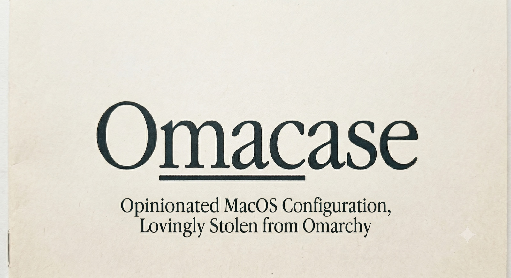

# Omacase

**Omarchy for macOS, with macOS allowed to remain macOS.**

Omacase is light configuration management, a coherent theming system, and an
opinionated application installer/updater for Apple Silicon Macs. OmniWM owns
tiling, workspaces, borders, its workspace bar, window rules, and keyboard
shortcuts. Omacase supplies a first-run seed and then leaves OmniWM's live
settings user-editable.

Supported platform: Apple Silicon, macOS 26 or later, and Homebrew at
`/opt/homebrew`.

```bash
/bin/bash -c "$(curl --proto '=https' --tlsv1.2 -fsSL https://omacase.org/install)"
omacase doctor
```

The installer enables “Displays have separate Spaces,” which OmniWM requires,
and disables Stage Manager so every tile remains visible. Log out and back in
once after the first install, then grant OmniWM Accessibility access when macOS
asks.

## What it manages

| Layer | Choice |
|---|---|
| Window environment | **OmniWM** — Dwindle default, nine workspaces, borders, workspace bar, overview, quake terminal |
| Launcher | **Spotlight** plus generated `Oma …` web-app/menu launchers |
| Terminal | **Ghostty**, zsh, Starship, tmux, and a modern CLI set |
| Editor | **Neovim / LazyVim** |
| Applications | **Homebrew + Brewfile** |
| Dotfiles | Omacase-owned symlinks from `home/` |
| Themes | 21 coordinated themes for terminal, CLI, editor, prompt, macOS appearance/accent, and wallpaper |
| Recovery | Snapshots of managed config, live OmniWM settings, and touched macOS defaults |

Omacase seeds `~/.config/omniwm/settings.toml` only when it does not exist.
After that, OmniWM and the user own the file. `omacase install` and
`omacase update` do not replace it.

## Daily commands

```text
omacase install             idempotent full setup
omacase update              update Omacase, packages, apps, and managed config
omacase doctor              check OmniWM, macOS settings, and permissions
omacase wm                  start and verify OmniWM
omacase keybinds            display the complete key reference
omacase theme [name]        apply a coordinated theme
omacase palette [name]      edit a theme's terminal ANSI palette
omacase wallpaper [...]     list or change the active theme wallpaper
omacase webapp [name]       open a named web app
omacase launchers [...]     build/remove Spotlight “Oma …” launchers
omacase backup [label]      snapshot managed state and live OmniWM settings
omacase restore [id]        restore a snapshot
omacase migrate             run one-time changeovers
omacase uninstall           remove Omacase-managed config; keep applications
```

Set `OMACASE_DRYRUN=1` before `omacase install` to preview changes. Set
`OMACASE_SKIP_MISE_UPGRADE=1` before `omacase update` to leave mise-managed
tools at their current versions. Set `OMACASE_INSTALL_GROK=1` to explicitly
allow xAI's unpinned Grok installer; it is skipped by default.

## OmniWM shortcuts

Omacase uses OmniWM's native Option-based shortcuts.

| Keys | Action |
|---|---|
| `⌥ + Arrow` | Focus a window |
| `⌥⇧ + Arrow` | Move/join/extract a window, depending on layout context |
| `⌥ + 1…9` | Switch workspace |
| `⌥⇧ + 1…9` | Move the focused window to a workspace |
| `⌥ + Return` | Toggle fullscreen |
| `⌥ + .` / `⌥ + ,` | Cycle focused size |
| `⌥⇧ + B` | Balance sizes |
| ``⌥ + ` `` | Toggle OmniWM's quake terminal |
| `⌥⇧ + O` | Toggle overview |
| `⌃⌥ + Space` | OmniWM command palette |
| `⌥⇧ + L` | Toggle the workspace layout |

All shortcuts can be changed in OmniWM → Settings → Hotkeys. See
[KEYBINDS.md](KEYBINDS.md) for the fuller working set.

## Themes and ownership

`omacase theme <name>` rethemes Ghostty, btop, Neovim, Starship, Claude Code,
the macOS Light/Dark appearance and accent, and the wallpaper. It also writes a
neutral palette link at `~/.config/omacase/theme.sh` for future integrations.
It does not rewrite OmniWM's saved settings.

Omarchy-derived colors and wallpapers are downloaded from Basecamp's Omarchy
repository and cached under `~/.local/share/omacase`. Local themes live in
`themes/`; see [docs/ADDING_A_THEME.md](docs/ADDING_A_THEME.md).

## Boundaries

Omacase does not automate macOS privacy grants. OmniWM needs Accessibility.
Input Monitoring is only needed if you opt into OmniWM's single-key system
Hyper trigger. Theme appearance sync needs Automation access from your terminal
to System Events.

Omacase also leaves native screenshots, Focus modes, media controls, clipboard
history, and app switching to macOS.

## License

Omacase's original code and assets are MIT licensed. Third-party applications
and downloaded artifacts retain their upstream licenses. See
[THIRD_PARTY_NOTICES.md](THIRD_PARTY_NOTICES.md).
